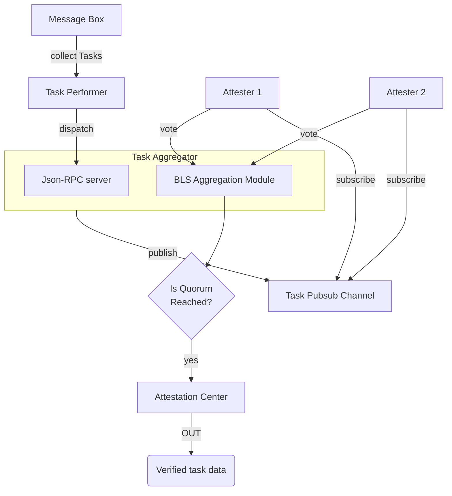

<Note>
This document assumes a prerequisite understanding of the Skate Architecture, which can be found [here](/architecture/skate#skates-kernel-and-periphery)
</Note>

Preconfirmation AVS verifies all execution calldata submitted by executors, which is published to the [Message Box contract](/architecture/kernel#kernel-components). 

## Network components

The Othentic Stack utilizes libp2p for inter-node communication to ensure a robust, efficient, and decentralized attestation process. Four types of nodes are involved:

1. **Task Performer** 
  Collect tasks from the Message Box, sign them, and then publish them to aggregator via a JSON-RPC server. For data-intensive applications, the Task Performer acts as an authority to source/pre-validate data for the AVS network, such as an application that requires Oracle

2. **Task Aggregator** 
  The Aggregator monitors and aggregates attestations within the network. It receive preformer update from performer and publish the task to a **p2p channel**, effectively requesting attester to particiapte in the attestation process.

3. **Attesters** 
  Subscribe to the **p2p channel** and sign using BLS signatures to participate in the attestation process. These nodes must ensure the validity of the underlying task data (executor calldata) and are therefore subject to rewards or slashing.

4. **Bootstrapers** 
  These robust nodes keep the p2p network alive by maintaining and updating the Distributed Hash Table for peer discovery.

<Note>
  Performer, Aggregator, and Attester must be an AVS operator.
</Note>

Together, these nodes ensure the attestation process is robust, scalable, and maintains a fair reward/penalty distribution for all involved parties.

The flow is depicted in the diagram below:

<Card title="AVS Flow Diagram">

</Card>

## AVS smart contracts

As mentioned, Skate leverages [Othentic's stateless rollup framework](https://othentic.gitbook.io/main/stateless-rollup-framework/abstract), which comes with the following set of contracts:

1. **AVS Governance** 
  A set of governance contracts oversees the registration, slashing, and reward distribution for all AVS operators. These contracts operate on Ethereum L1, where all EigenLayer restakers reside, as one must be an EigenLayer staker to participate as an AVS operator.
1. **Attestation Center** 
  These contracts handle attestation processing, including signature aggregation for each quorum, which involves verifying a batch of tasks. They also manage the business logic for distributing rewards for operations and post-processing. Due to the high cost of these processes, the contracts are deployed on L2 and update L1 through the Network Management layer.

1. **Network Management Layer** 
  A cross-chain messaging layer ensures synchronization between the AVS Governance contracts on L1 and the Attestation Center on L2.

