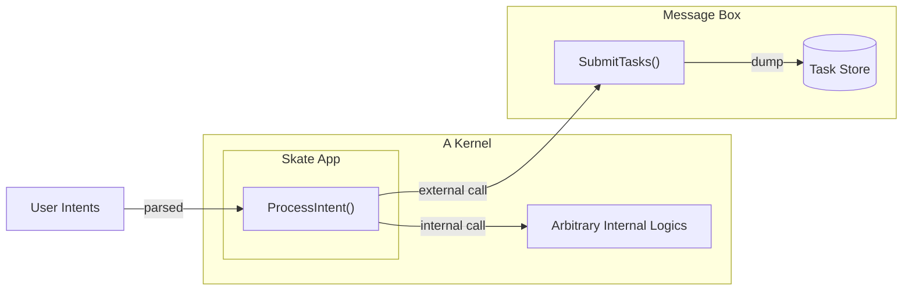

<Note>
  This document requires a prerequisites understanding of the Skate Architecture, you may find it [here](/architecture/skate#skates-kernel-and-periphery)
</Note>

## Kernel Components

The kernel reside on Skate Chain consists of 2 core components:

1. **Message Box**: is a single contract that defines interface for _all Skate Apps_ to register user intent and corresponding execution tasks. It serves as the entry point for creating intents, and all executors will source this contract for pending actions.

1. **Skate App**: is the base contract that all kernel implementations must inherit from. Skate App has the responsbility to: 
    + Defining the interface for executors to reserve execution of intents.
    + Transforming user intents to imperative tasks for executions.
    + Pushing relevant data into Message Box.
    + Link the kernel app to all periphery apps on destination chains.

An overview of the interaction with Kernel are shown in the diagram below:

<Card title="Kernel Flow Diagram">

</Card>

In addition, an Executor Registry will live on Skate to register actors with the capability to process user intents. For in-depth details, refer to [execution network](/architecture/execution-network)
