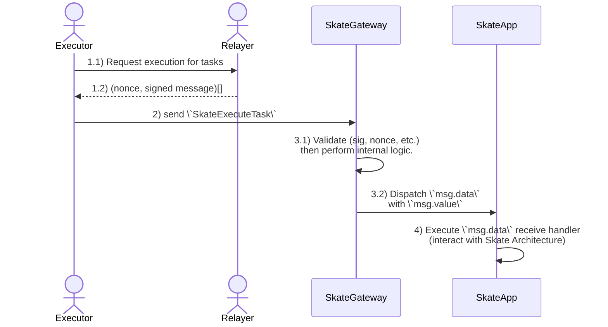
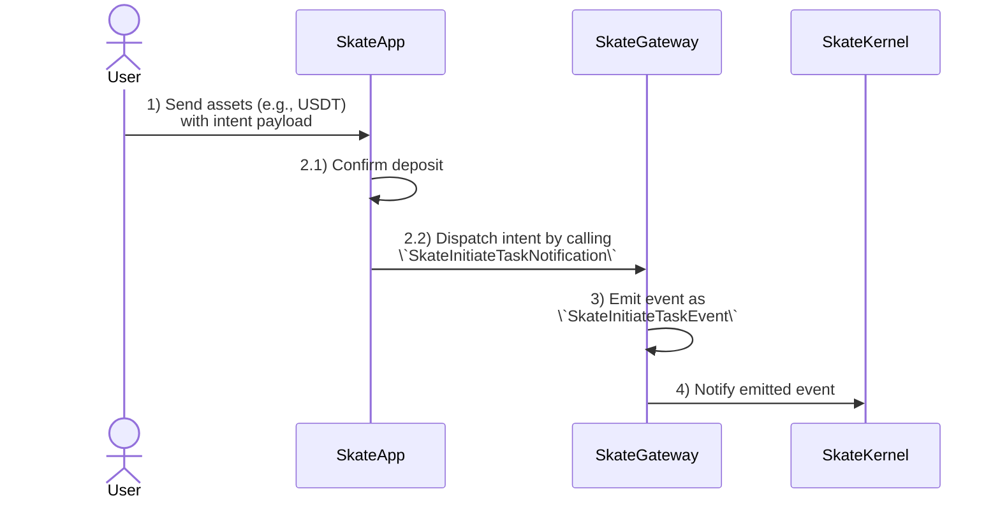

## Architecture Overview

Skate infrastructure on TON consists of three major components:

1. **Skate Gateway:**
    + Serves as the entry point for executors to initiate execution and settle user intents.
    + Acts as TON's MessageBox for users to initiate intents involving asset staging.

2. **Skate App:**
    + The base trait required for all DApps to ensure interoperability with the Skate Infrastructure.

3. **Skate Wallet Registry:**
    + Defines the intent standard for syncing wallets between TON and other virtual machines (VMs).
    + Replies to TON DApps with the Skate synced wallet map across different VMs.

## TON Gateway

The Skate Gateway on TON is implemented in Tact and the current code for the testnet version available at [https://verifier.ton.org/EQCQev2uURuj78OtbNU99YQb3F3dHAgwYWU_s8vqDHg4Q7o7?testnet](https://verifier.ton.org/EQCQev2uURuj78OtbNU99YQb3F3dHAgwYWU_s8vqDHg4Q7o7?testnet)

### Intent settlement flow

The intent settlement by executor flow is as follows:

1. Executor requests for execution from Relayer. Relayer responses with nonces and signed execution messages. 
<Note>
 _**NOTE:** To ensure high throughput, Skate Gateway operates similarly to a shared [HighloadWalletV3](https://github.com/ton-blockchain/highload-wallet-contract-v3), where the relayer is responsible for nonce management and message signing._

A repository of available execution messages will be available at `https://relayer.service.skatechain.org/ton`
</Note>
2. Executor calls `SkateExecuteTask` on the Skate Gateway. The TON TL-B is:
`skate_execute_task#23dc99bb query_id:uint64 nonce:uint32 created_at:uint64 target_app:address execution_info:ExecutionInfo{value:coins,expiration:uint32,payload:Payload{destination:^cell,data:^cell}} relayer_signature:^slice = SkateExecuteTask`
3. Skate Gateway validates the message integrity (checking the relayer's signature, expiration, etc.) and then dispatches the message to the Skate App.
4. Skate App executes the corresponding receive message handler, effectively settle user intent.

<Card title="Executor flow">

</Card>

### Intent initiation flow (with staging assets)

Whenever an intent involves staging assets, user must deposit assets with the payload specifying the intent structure. The flow is as follows:

1. User send assets (E.g. USDT) with payload to the Skate App.
2. Skate App confirms the deposit and then dispatches the intent to Gateway using `SkateInitiateTaskNotification` message. 
The TON TL-B of this receive handler is:
`skate_initiate_task_notification#3938aff1 query_id:uint64 user:address execution_info:ExecutionInfo{value:coins,expiration:uint32,payload:Payload{destination:^cell,data:^cell}} = SkateInitiateTaskNotification`
3. Skate Gateway emit the message as a `SkateInitiateTaskEvent`. The TON TL-B of this receive handler is: `skate_initiate_task_event#7560bbc5 query_id:uint64 user:address skate_app:address execution_info:ExecutionInfo{value:coins,expiration:uint32,payload:Payload{destination:^cell,data:^cell}} = SkateInitiateTaskEvent`
4. The Skate Kernel picks up the event as user intent then start [Skate flow](/main/architecture/skate#client-server-architecture).

<Card title="Executor flow">

</Card>

## TON Wallet Registry

The Skate WalletRegistry on TON is implemented in Tact, with the current source code for the testnet version available at [https://verifier.ton.org/EQDEtAuiKRmFXe8fHrE0FvDJoaNrms3TtZr4s1xw0dI9Et96?testnet](https://verifier.ton.org/EQDEtAuiKRmFXe8fHrE0FvDJoaNrms3TtZr4s1xw0dI9Et96?testnet)

See [Sync Wallet](/developers/sync-wallet) for the detailed flows.

## SkateApp on TON

The base SkateApp trait on TON is implemented in Tact, with the current source code for the testnet version available at [`SkateApp.tact`](https://verifier.ton.org/EQDEtAuiKRmFXe8fHrE0FvDJoaNrms3TtZr4s1xw0dI9Et96?testnet)

A Skate App must define the following handlers to interact with the Skate infrastructure:

1. Executor Settlement Handler: This handler is used to process user intents and must only be called by the Skate gateway for the executor to settle these intents. The TL-B schema used for this can be any custom-defined schema suitable for the application's needs.

2. Intent with Staging Assets Handler: For interactions involving asset staging, the function must invoke the SkateInitiateTaskNotification on the Skate Gateway, with TON TL-B schema:
`skate_initiate_task_notification#3938aff1 query_id:uint64 user:address execution_info:ExecutionInfo{value:coins,expiration:uint32,payload:Payload{destination:^cell,data:^cell}} = SkateInitiateTaskNotification`

For DApp developers, take notes of the following

<CardGroup cols={2}>
  <Card title="Building Skate App" icon="square-1">
    See example Skate App implementations with 2 interactions model in [Case Studies](/developers/ton/case-studies).
  </Card>
  <Card title="Setting up executors" icon="square-2">
    We are working on improving the registration process. For now, contact Skate on Discord for support!
  </Card>
</CardGroup>
