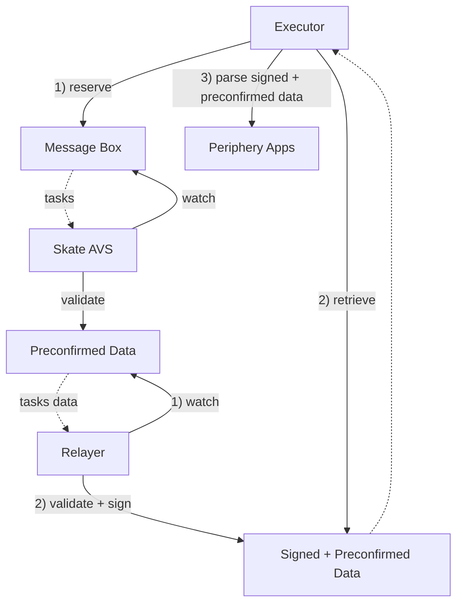

<Note>
This document assumes a prerequisite understanding of the Skate Architecture, which can be found [here](/main/architecture/skate#skates-kernel-and-periphery)
</Note>

Skate Execution Network consists of **a transaction relayer** and **a set of executors**:

1. **Executors** 
  These specialized entities, either from Skate or third-party providers, handle user intents across blockchains. They must manage their own cross-chain inventories and execution plans. In exchange, they receive fees from users who need their transactions settled through Skate.

<Note>
  Executor onboarding is still a work in progress, please check for latest news on [twitter](https://x.com/skate_chain)
</Note>

2. **Relayer** 
  The relayer oversees the confirmation results from [Skate Preconfirmation AVS](/main/architecture/avs) and attests to them by signing, effectively preparing the calldata for the executor.

A high level overview of the flow within execution network

<Card title="Execution Network flow">

</Card>
