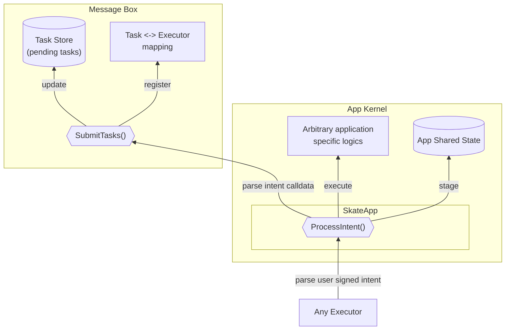

<Note>
This document assumes a prerequisite understanding of the Skate Architecture, which can be found [here](/main/architecture/skate#skates-kernel-and-periphery)
</Note>

## Kernel Components
<Frame caption="Kernel Diagram">
  
</Frame>
The kernel components are responsible for managing the **unified state** and **executing essential logic**.

1. **Message Box**
    
    A single contract that defines interface for *all Skate Apps* to register user intent and corresponding execution tasks. It serves as the entry point for creating intents, and all executors will source this contract for pending actions.
    
2. **Skate App**
    
    The base contract that all kernel implementations must inherit from. Skate App does
    
    - Transforming user intents to imperative tasks for executions.
    - Pushing relevant data into Message Box.
    - Link the kernel app to all periphery apps on destination chains.

An overview of the interaction with Kernel is shown in the diagram below:

<Card title="Kernel Flow Diagram">

</Card>

In addition, an Executor Registry will live on Skate to register actors with the capability to process user intents. For in-depth details, refer to [execution network](/main/architecture/execution-network)
