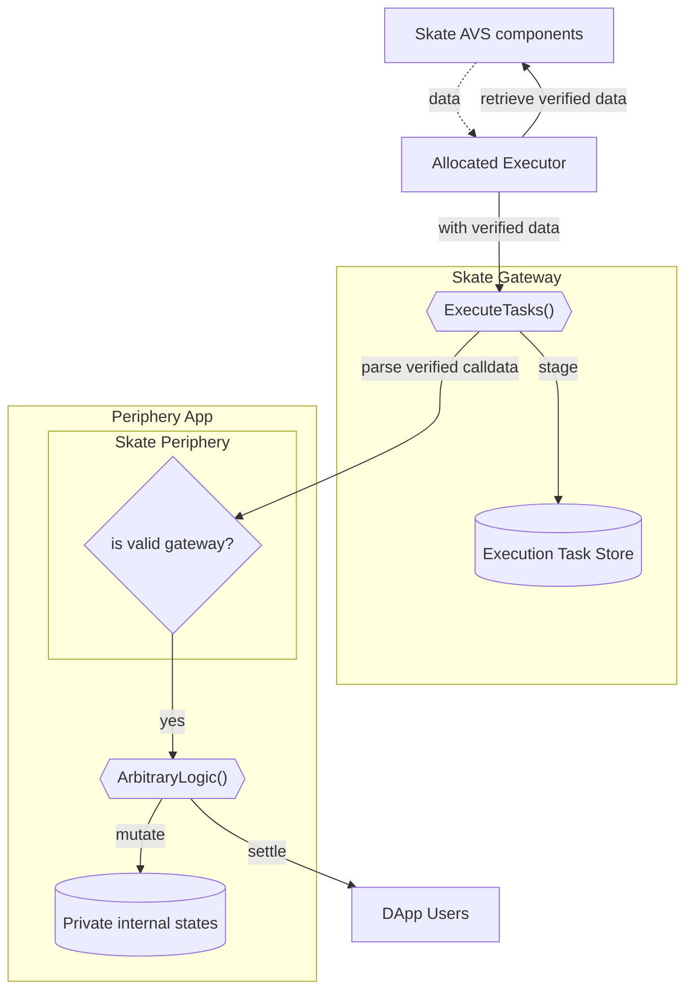

<Note>
This document assumes a prerequisite understanding of the Skate Architecture, which can be found [here](/main/architecture/skate#skates-kernel-and-periphery)
</Note>

## Periphery Components
<Frame caption="Periphery Diagram">
  
</Frame>
Periphery contracts are contracts that reside on the connected chains across TonVM, EVM, Solana VM etc. It is where the will end user interact with, they hold arbitrary logic and reference kernel for the shared storage. Periphery contracts comprises of 2 components: 

1. **Skate Gateway**
    
    This contract defines the interface for all executors to settle user intents, provided the preconfirmed calldata has been signed by a relayer. It:
    
    - Defines the relayer, an authority from [**AVS**](https://docs.skatechain.org/main/architecture/avs) that attests to and vouches for the preconfirmation results.
    - Performs external calls to arbitrary periphery contracts
    - Keeps records of executed tasks, ensuring eventual consistency with the kernel
2. **Skate Periphery contract**
    - The base contract that all periphery implementations must inherit from. It must pre-register the gateway address and restrict state mutation authority to this address.
    - Facilitate interactions on the current chain based on directives issued from Kernel

An overview of the flow from avs to periphery is shown in the diagram below:

<Card title="Periphery Settlement Diagram">

</Card>

Similar to [kernel](/main/architecture/kernel), a synced Executor Registry (with guaranteed Consistency and Partition tolerence) will live on Skate to register these actors, _who are chain native addresses_, with the capability to process user intents. For in-depth details, refer to [execution network](/main/architecture/execution-network)
