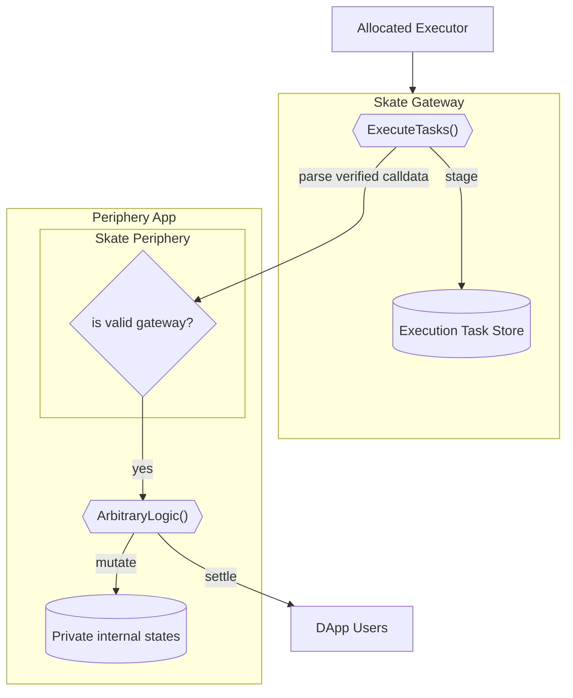

<Note>
This document assumes a prerequisite understanding of the Skate Architecture, which can be found [here](/main/architecture/skate#skates-kernel-and-periphery)
</Note>

## Design of the Periphery Gateway

Periphery gateways are those contracts that end user interact with, they hold arbitrary logic and reference kernel for the shared storage. All periphery contracts use the following 2 components:

1. **Skate Gateway** 
  This contract defines the interface for all executors to settle a user intent, provided the preconfirmed calldata has been signed by a relayer. It:
    + Defines the relayer, an authority from [AVS](/main/architecture/avs) that attests to and vouches for the preconfirmation results.
    + Performs external calls to arbitrary periphery contracts
    + Keeps records of executed tasks, ensuring eventual consistency with the kernel

1. **Skate Periphery contract** 
  The base contract that all periphery implementations must inherit from. It must pre-register the gateway address and restrict state mutation authority to this address.

An overview of the flow from avs to periphery is shown in the diagram below:

<Card title="Periphery Settlement Diagram">

</Card>

Similar to [kernel](/main/architecture/kernel), an synced Executor Registry will live on Skate to register actors _(who are chain native addresses)_ with the capability to process user intents. For in-depth details, refer to [execution network](/main/architecture/execution-network)
