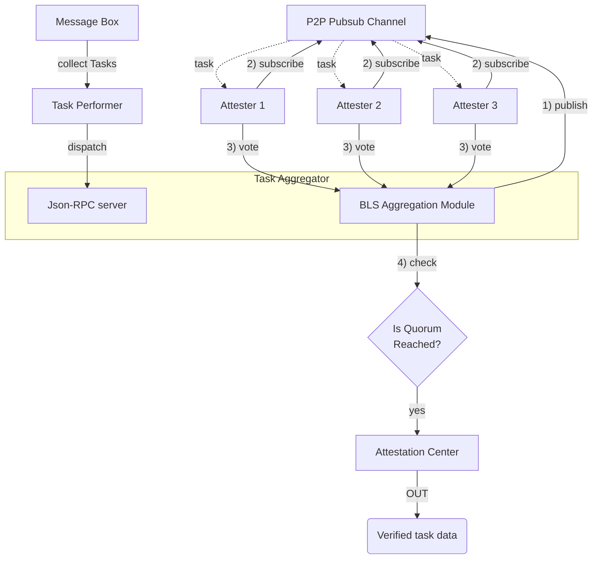

<Note>
  This document is intended for [EigenLayer Operator](https://docs.eigenlayer.xyz/eigenlayer/operator-guides/operator-introduction) and requires understanding of [EigenLayer AVS](https://docs.eigenlayer.xyz/eigenlayer/avs-guides/avs-developer-guide)

Additionally, a general understanding of [Skate architecture](/main/architecture/skate) is assumed.

</Note>

## What is EigenCloud, Othentic?

The **Skate** architecture secures its core multi-chain operations using an **Actively Validated Service (AVS)** named **EigenCloud**, which is powered by the **Othentic AVS framework**. This integration allows Skate to leverage the **pooled economic security of Ethereum Restaking** to establish a verifiable, trust-minimized execution layer.

- **EigenCloud:** The infrastructure layer (formerly EigenLayer) that provides the contracts and runtime services used by Skate's AVS. Skate's AVS remains our service **Skate AVS** - which is powered by EigenCloud (contracts and infra) and **Othentic** (tooling and configs). Skate retains custom logic on top of this stack (input data structures, operator configuration, aggregation rules, and business rules). Skate AVS's primary function is to produce verifiable, finality‑ready proofs of execution for a bundle of Skate tasks destined for the same target chain by computing a single, cryptographically secure **Merkle Root** that represents the batch's integrity, enabling batched, trust‑minimized multi‑chain transaction settlement.

- **Othentic:** This is the underlying AVS framework that provides the foundational tooling (CLI, governance, and attestation contracts) to manage the AVS. It is responsible for collecting the validated **`AvsProofData`** (which includes the Merkle Root) from Aggregators and submitting it to the on-chain `AttestationCenter`.

The combined system ensures that complex, cross-chain state management, which is crucial for the Stateless AMM's unified liquidity, is secured by a dedicated, economically-bonded set of verifiers.

## Security Model (Restaking, Slashing)

The security is rooted in the **EigenLayer restaking model**, extending Ethereum's trust layer to Skate's custom validation logic.

- **Restaking:** Operators secure their role by restaking ETH/LSTs, providing **capital collateral** against misbehavior.

- **Slashing:** Malicious activity results in a loss of this collateral. It is enforced for critical security breaches involving the validation proof: **attesting to or aggregating an invalid Merkle Root** for a batch of Skate Tasks, or for providing a fraudulent Merkle proof to attest to the inclusion of a task that was never legitimately executed/submitted. Any failure to correctly run the core integrity checks (e.g., `hashSkateTask` or `buildMerkleTree`) is a violation of the AVS's service contract.

## AVS Operators

**AVS Operators are decentralized participants** who run the specialized node software required to provide security for the EigenCloud AVS.

**Roles & Components:** Operators are required to run several core services:

- **Performer Node (`/performer`):** Retrieves individual `SkateTask` messages from the `Skate MessageBox` and bundles them based on destination chain (`chainId/vmType`) constraints.

- **Attester Node:** Performs the local validation, primarily by calculating the **Task Hashes** and constructing the **Merkle Tree** for the bundle using the `constructProofFromTaskBundle` logic.

- **Aggregator Node:** Collects and aggregates the resulting `AvsProofData` (including the Merkle Root) from Attesters, verifies consensus, and submits the final encoded proof data (`encodeTaskDataMapForSolidity`) to the Othentic smart contract.

- **Tracking:** Operator activity and AVS health can be tracked via the AVS Dashboard (`/dashboard`).

The hardware requirements will be dependent on the role of operator. Refers to operator [roles](/operators/roles) section for further details.

## Economic Security Guarantees

The Economic Security Guarantees quantify the trust provided to Skate users.

- **Pooled Security:** The total value of ETH restaked ensures a high **Cost of Corruption**, making a hostile takeover uneconomical.

- **Slashing-Based Guarantee:** The security commitment is to maintain sufficient restaked capital to penalize any fraudulent proof submission. This target is calibrated to **secure the aggregate liquidity of the Stateless AMM against invalid cross-chain state updates and fraudulent settlement claims, ensuring the finality and integrity of all cross-VM trades and the unified liquidity model**. 

## Network Components

The Othentic Stack utilizes libp2p for inter-node communication to ensure a robust, efficient, and decentralized attestation process. Four types of nodes are involved:

1. **Task Performer** 
  Collect tasks from the Message Box, sign them, and then publish them to aggregator via a JSON-RPC server. For data-intensive applications, the Task Performer acts as an authority to source/pre-validate data for the AVS network, such as an application that requires Oracle

2. **Task Aggregator** 
  The Aggregator monitors and aggregates attestations within the network. It receive performer update from performer and publish the task to a **p2p channel**, effectively requesting attester to participate in the attestation process.

3. **Attesters** 
  Subscribe to the **p2p channel** and sign using BLS signatures to participate in the attestation process. These nodes must ensure the validity of the underlying task data (executor calldata) and are therefore subject to rewards or slashing.

4. **Bootstrappers** 
  These robust nodes keep the p2p network alive by maintaining and updating the Distributed Hash Table for peer discovery.

<Note>
  Performer, Aggregator, and Attester must be an AVS operator.
</Note>

Together, these nodes ensure the attestation process is robust, scalable, and maintains a fair reward/penalty distribution for all involved parties.

The flow is depicted in the diagram below:

<Card title="AVS Flow Diagram">

</Card>

## Source Code

Skate uses [Othentic's stack](/operators/general/othentic), the contracts code is not available for public at the moment.

<Note>
  Though the code is not public, architecture and attestation framework can be
  found at
  [https://othentic.gitbook.io/main/avs-framework/smart-contracts/othentic-bls-obls](https://othentic.gitbook.io/main/avs-framework/smart-contracts/othentic-bls-obls)
</Note>

<Note>
  Off-chain AVS services code is now live and publicly available at
  [https://github.com/Skate-Org/skate-avs](https://github.com/Skate-Org/skate-avs).
</Note>

## Rewards Structure

We are working on finalizing the rewards structure. Details will be discussed once our PoC for public go live.

## AVS Smart Contracts

As mentioned, Skate leverages [Othentic's stateless rollup framework](https://othentic.gitbook.io/main/stateless-rollup-framework/abstract), which comes with the following set of contracts:

1. **AVS Governance** 
  A set of governance contracts oversees the registration, slashing, and reward distribution for all AVS operators. These contracts operate on Ethereum L1, where all EigenLayer restakers reside, as one must be an EigenLayer staker to participate as an AVS operator.
1. **Attestation Center** 
  These contracts handle attestation processing, including signature aggregation for each quorum, which involves verifying a batch of tasks. They also manage the business logic for distributing rewards for operations and post-processing. Due to the high cost of these processes, the contracts are deployed on L2 and update L1 through the Network Management layer.

1. **Network Management Layer** 
  A cross-chain messaging layer ensures synchronization between the AVS Governance contracts on L1 and the Attestation Center on L2.

