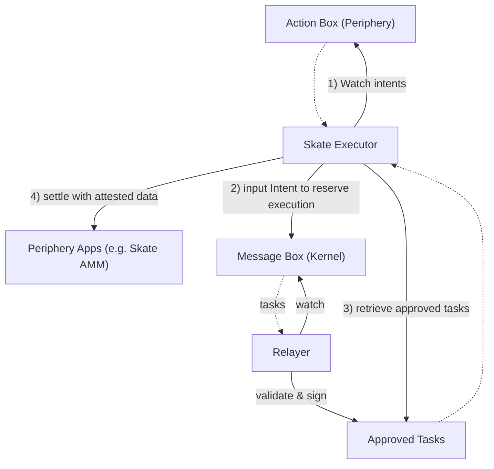

## Components

Skate Execution Network consists of **a set of executors**, **a transaction relayer**, and **Executor Registries** on kernel and periphery chains:

1. **Executors**

  These specialized entities, either from Skate or third-party providers, handle user intents across blockchains. They must manage their own cross-chain inventories and execution plans. In exchange, they receive fees from users who need their transactions settled through Skate.

2. **Relayer**

  The relayer oversees the confirmation results from [Skate AVS](/main/infrastructure-components/eigencloud-avs) and attests to them, effectively preparing the required settlement data for executors.

3. **Executor Registry**

  The Executor Registry manages the addition and removal of executors. 

## Execution Flow

<Steps>
  <Step title="Watch Intent">
    Watch intents on ActionBox from user across periphery. Either via API or self-indexing.
  </Step>
  <Step title="Reserve Intent">
    Await approved intents by Skate AVS. Then reserve interested intents to fill on Kernel Message Box
  </Step>
  <Step title="Retrieve approved tasks">
    Intents flow through Kernel Apps are then processed into tasks. Executors need to settle the registered intents based on these tasks information
  </Step>
  <Step title="Settle Tasks">
    Once approved tasks is acknowledged. Executors schedule settlement on corresponding periphery chains, effectively end a Skate Intent flow
  </Step>
</Steps>

The flow diagram below depicts an intent processed by Execution Network

<Card title="Execution Network flow">

</Card>
